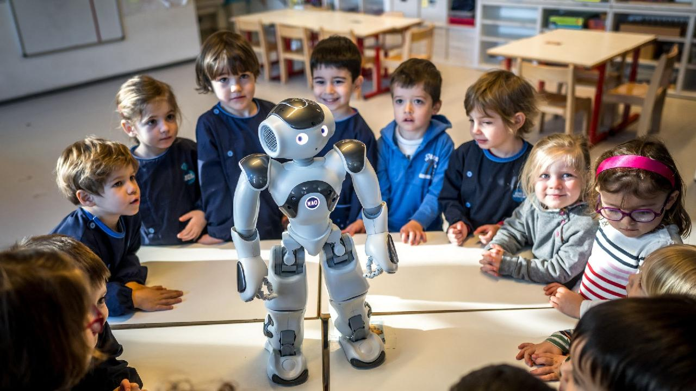

# 🤖 EduNAO

## 🧠 Overview
Python applications for the NAO robot, designed to interact with children in nurseries and provide an easy-to-use interface for educators.  
Includes simple GUI tools and ready-to-run interaction scripts built during my robotics master studies at EPFL, part of my job at the Educalis school as Software Engineer.

  

## ⚙️ Technical Details

| Category | Details |
|-----------|----------|
| **Languages** | Python |
| **Frameworks / Libraries** | `naoqi`, `qi`, `PyQt5`, `SpeechRecognition`, `OpenCV` |
| **Techniques** | Human–Robot Interaction (HRI), voice and gesture recognition, basic GUI design for educators |
| **Hardware** | NAO V5 humanoid robot |
| **Environment** | Ubuntu 22.04, Python 3.10, VS Code |
| **Features** | Interactive games and dialogue scenarios for children; simple Python-based graphical interface allowing nursery educators to trigger or adapt NAO behaviors without programming knowledge |

## 📄 Media

**Tech Xplore** — [Read here](https://techxplore.com/news/2024-05-swiss-nursery-robot.html)  
